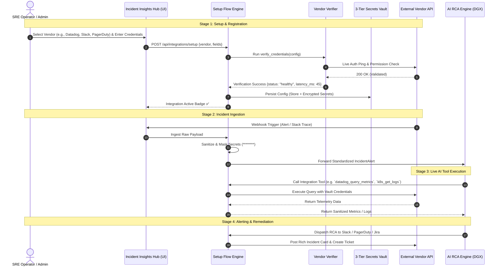

# OpenSRE — Comprehensive Integrations Architecture & Implementation Guide

> **Universal Ecosystem Integration Framework: Connecting 60+ Observability, Workflow, Cloud, Database, ITSM, and ChatOps Platforms into OpenSRE**
>
> Reference: [Tracer-Cloud/opensre Integrations Catalog](https://github.com/Tracer-Cloud/opensre/tree/main/integrations)

---

## 📑 Table of Contents

1. [Executive Summary & Architectural Vision](#1-executive-summary--architectural-vision)
2. [Ecosystem Taxonomy: The 60+ Integrations Catalog](#2-ecosystem-taxonomy-the-60-integrations-catalog)
3. [The Core Integration Engine Architecture](#3-the-core-integration-engine-architecture)
4. [The 4-Stage Lifecycle: How an Integration Works](#4-the-4-stage-lifecycle-how-an-integration-works)
5. [Step-by-Step Implementation Blueprint for Our Codebase](#5-step-by-step-implementation-blueprint-for-our-codebase)
6. [Category-by-Category Deep Dive & Configuration Specs](#6-category-by-category-deep-dive--configuration-specs)
7. [Agent Tooling & Model Context Protocol (MCP) Bridge](#7-agent-tooling--model-context-protocol-mcp-bridge)
8. [Security, Secrets Vault & Clean Masking Architecture](#8-security-secrets-vault--clean-masking-architecture)
9. [Frontend Experience: The Incident Insights Hub Integrations Center](#9-frontend-experience-the-incident-insights-hub-integrations-center)
10. [Testing, Health Probing & Verification Strategy](#10-testing-health-probing--verification-strategy)
11. [Rollout & Adoption Roadmap](#11-rollout--adoption-roadmap)

---

## 1. Executive Summary & Architectural Vision

### 1.1 The Integration Problem in Modern SRE
Modern enterprise systems are composed of heterogeneous stacks:
- Workflows running on **Camunda, Pega, Temporal, Airflow**
- Microservices hosted on **Kubernetes (EKS, GKE, AKS), AWS Lambda, Bare Metal**
- Telemetry split across **Datadog, Grafana (Loki/Tempo/Mimir), Sentry, CloudWatch, Splunk**
- Data stored across **PostgreSQL, Redis, Kafka, MongoDB, Snowflake**
- Incidents triaged via **PagerDuty, Opsgenie, Slack, Jira, ServiceNow**

Traditional SRE requires engineers to manually jump across 5–10 different browser tabs during an outage.

### 1.2 OpenSRE Unified Integration Philosophy
OpenSRE acts as the **central nervous system** for enterprise operations. By adopting the modular integration architecture from [`Tracer-Cloud/opensre/integrations`](https://github.com/Tracer-Cloud/opensre/tree/main/integrations), OpenSRE standardizes:
1. **Unified Alert & Log Ingestion:** Ingest telemetry from any source into a normalized `IncidentAlert` schema.
2. **Context-Aware Deep Querying:** Allow the AI RCA Engine (NVIDIA DGX / Qwen 35B) to actively query APM metrics, fetch trace spans, and read database connection states during investigation.
3. **Automated Remediation & ChatOps:** Dispatch rich, masked incident reports to Slack/Teams and trigger safe auto-remediation actions (pod restarts, Zeebe task retries, ticket creation) with human-in-the-loop approvals.

---

## 2. Ecosystem Taxonomy: The 60+ Integrations Catalog

OpenSRE categorizes all enterprise integrations into **8 functional pillars**:

```
┌──────────────────────────────────────────────────────────────────────────────────────────────────┐
│                                   OPENSRE INTEGRATION ECOSYSTEM                                  │
├──────────────────────────────┬──────────────────────────────┬────────────────────────────────────┤
│ 1. Observability & APM       │ 2. Workflow & Orchestration  │ 3. Cloud & Infrastructure          │
│ • Datadog                    │ • Camunda 8 (Zeebe/Operate)  │ • Kubernetes / EKS / Helm          │
│ • New Relic                  │ • Camunda 7 (REST Engine)    │ • AWS (EC2, Lambda, SQS, S3, RDS)  │
│ • Sentry / Sentry MCP        │ • Pega Systems (PRPC)        │ • Azure / Azure SQL                │
│ • Grafana (Loki/Tempo/Mimir) │ • Temporal                   │ • ArgoCD (GitOps)                  │
│ • Dynatrace / SigNoz         │ • Apache Airflow             │ • Railway / Vercel                 │
│ • Honeycomb / Coralogix      │ • Dagster / Prefect          │ • Yandex Cloud                     │
│ • Splunk / CloudWatch        │                              │                                    │
├──────────────────────────────┼──────────────────────────────┼────────────────────────────────────┤
│ 4. Databases & Messaging     │ 5. Incident Management (ITSM)│ 6. ChatOps & Collaboration         │
│ • PostgreSQL / MySQL/ MariaDB│ • PagerDuty                  │ • Slack (Interactive Cards/Modals) │
│ • Redis (Cluster / Sentinel) │ • Opsgenie                   │ • Microsoft Teams                  │
│ • Apache Kafka / RabbitMQ    │ • ServiceNow                 │ • Discord / Telegram               │
│ • MongoDB / MongoDB Atlas    │ • Jira Service Management    │ • Rocket.Chat / Mattermost         │
│ • ClickHouse / Snowflake     │ • incident.io / BetterStack  │ • Twilio (SMS/Voice) / SMTP Email  │
│ • Elasticsearch / OpenSearch │ • Alertmanager               │                                    │
├──────────────────────────────┴──────────────────────────────┴────────────────────────────────────┤
│ 7. CI/CD & Version Control: GitHub, GitLab, Bitbucket, Jenkins, Git                             │
│ 8. Knowledge & Docs: Confluence, Google Docs, Notion, Multi-Format Runbooks (PDF/Word)     │
└──────────────────────────────────────────────────────────────────────────────────────────────────┘
```

---

## 3. The Core Integration Engine Architecture

To guarantee stability, security, and zero vendor lock-in, every integration in OpenSRE follows a strict **decoupled, modular architecture**.

```
                                      ┌────────────────────────┐
                                      │   Web UI / CLI / API   │
                                      └───────────┬────────────┘
                                                  │ Configuration Payload
                                                  ▼
┌──────────────────────────────────────────────────────────────────────────────────────────────────┐
│                                   CORE INTEGRATION ENGINE                                        │
│                                                                                                  │
│  ┌──────────────────────────────┐  ┌──────────────────────────────┐  ┌────────────────────────┐  │
│  │   Catalog & Registry         │  │   Setup Flow Manager         │  │  3-Tier Secrets Vault  │  │
│  │   (`catalog.py`)             │  │   (`setup_flow.py`)          │  │  (`secrets_vault.py`)  │  │
│  │   • Metadata & Categories    │  │   • Spec Resolution          │  │  • Tier 1: Config Store│  │
│  │   • Pydantic Config Schemas  │  │   • Dynamic Field Validation │  │  • Tier 2: Keyring/Sec │  │
│  │   • Tool Discovery           │  │   • Preflight Verification   │  │  • Tier 3: Env Override│  │
│  └──────────────────────────────┘  └──────────────────────────────┘  └────────────────────────┘  │
└─────────────────────────────────────────────────┬────────────────────────────────────────────────┘
                                                  │
                   ┌──────────────────────────────┼──────────────────────────────┐
                   ▼                              ▼                              ▼
┌──────────────────────────────────┐ ┌──────────────────────────┐ ┌────────────────────────────────┐
│      1. Ingest Normalizer        │ │  2. Verifier & Prober    │ │    3. MCP Agent Tools          │
│ (`alert_source_catalog.py`)      │ │ (`verifier.py`)          │ │ (`/tools/<tool_name>/`)        │
│ Converts vendor webhooks into    │ │ Tests live auth, ping,   │ │ Equips DGX AI to query logs,   │
│ standardized `IncidentAlert`     │ │ latency & permissions    │ │ inspect metrics, restart pods  │
└──────────────────────────────────┘ └──────────────────────────┘ └────────────────────────────────┘
```

---

## 4. The 4-Stage Lifecycle: How an Integration Works

Every vendor adapter follows a 4-stage lifecycle:



---

## 5. Step-by-Step Implementation Blueprint for Our Codebase

To integrate this entire ecosystem into our current repository (`sentinel/` backend and `Incident Insights Hub/` frontend), we follow this systematic layout:

### 5.1 Directory Layout in `sentinel/`

```
sentinel/
├── integrations/                     # ── Core Integration Package ──
│   ├── __init__.py
│   ├── catalog.py                    # Registry of all 60+ adapters & categories
│   ├── config_models.py              # Pydantic schemas for all vendor configs
│   ├── setup_flow.py                 # Multi-tier credential setup & persistence
│   ├── secrets_vault.py              # AES-256 encrypted credential storage
│   ├── verifier_base.py              # Abstract base class for health verifiers
│   ├── alert_source_catalog.py       # Ingest normalizers for vendor alerts
│   ├── mcp_bridge.py                 # MCP server exposing integration tools to DGX
│   │
│   ├── camunda/                      # ── Vendor Adapter Packages ──
│   │   ├── __init__.py
│   │   ├── config.py                 # Camunda 8 & 7 connection specs
│   │   ├── client.py                 # Zeebe gRPC & Operate REST client
│   │   ├── verifier.py               # Live connection & auth probe
│   │   └── tools/                    # AI Agent Tools
│   │       ├── retry_incident_tool.py
│   │       ├── update_variables_tool.py
│   │       └── fetch_instance_xml_tool.py
│   │
│   ├── datadog/
│   │   ├── config.py, client.py, verifier.py
│   │   └── tools/ (query_metrics, fetch_traces, search_logs)
│   │
│   ├── slack/
│   │   ├── config.py, client.py, verifier.py
│   │   └── tools/ (post_incident_card, create_incident_channel, update_status)
│   │
│   ├── kubernetes/
│   │   ├── config.py, client.py, verifier.py
│   │   └── tools/ (get_pod_logs, describe_pod, restart_deployment)
│   │
│   ├── pagerduty/
│   │   ├── config.py, client.py, verifier.py
│   │   └── tools/ (trigger_incident, acknowledge_alert, resolve_incident)
│   │
│   ├── jira/
│   │   ├── config.py, client.py, verifier.py
│   │   └── tools/ (create_ticket, update_rca_issue, link_incident)
│   │
│   └── [40+ other vendor folders...]
│
├── api/
│   ├── integration_routes.py         # REST API for UI integration management
│   └── rca_routes.py                 # RCA engine routing with integration hooks
```

---

## 6. Category-by-Category Deep Dive & Configuration Specs

### 6.1 Observability & Monitoring Adapters

#### Datadog Adapter (`sentinel/integrations/datadog/`)
- **Required Config:** `DD_API_KEY`, `DD_APP_KEY`, `DD_SITE` (e.g., `datadoghq.com`, `datadoghq.eu`).
- **Capabilities:**
  - `datadog_search_logs`: Fetches contextual logs matching service, time window, and error tags.
  - `datadog_query_metrics`: Evaluates memory saturation, CPU spikes, and request error rates (P95/P99).
  - `datadog_get_trace`: Pulls APM distributed trace spans leading to the error.
- **Verifier:** Probes `GET https://api.datadoghq.com/api/v1/validate` returning status and API key validity.

#### Sentry Adapter (`sentinel/integrations/sentry/`)
- **Required Config:** `SENTRY_AUTH_TOKEN`, `SENTRY_ORG_SLUG`, `SENTRY_BASE_URL`.
- **Capabilities:**
  - Pulls exact stack traces, breadcrumbs, affected users, and release commit hash.
  - Links Sentry Issue ID directly inside the OpenSRE RCA card.

#### Grafana Stack (Loki, Tempo, Mimir, Prometheus)
- **Required Config:** `GRAFANA_URL`, `GRAFANA_SERVICE_ACCOUNT_TOKEN`, `LOKI_ENDPOINT`, `TEMPO_ENDPOINT`.
- **Capabilities:**
  - Queries LogQL for log streams and TraceQL for distributed trace visualizer.
  - Pulls Prometheus PromQL metric graphs for pool saturation and container restarts.

---

### 6.2 Workflow & Orchestration Adapters

#### Camunda 8 (Zeebe & Operate)
- **Required Config:** `ZEEBE_ADDRESS`, `CAMUNDA_OPERATE_URL`, `CAMUNDA_AUTH_TYPE` (Self-Managed Session Cookie vs SaaS OAuth2 Client Credentials).
- **Capabilities:**
  - Real-time incident listener, process instance variable viewer, BPMN XML diagram extraction, flow-node retry.

#### Pega Systems (PRPC)
- **Required Config:** `PEGA_REST_URL`, `PEGA_CLIENT_ID`, `PEGA_CLIENT_SECRET`, `PEGA_TENANT_ID`.
- **Capabilities:**
  - Ingests Pega Alert Log events (PEGA0001–PEGA0050), Rule Resolution failures, Data Page SLA timeouts.

#### Temporal
- **Required Config:** `TEMPORAL_ADDRESS` (gRPC), `TEMPORAL_NAMESPACE`, `TEMPORAL_TLS_CERT`, `TEMPORAL_TLS_KEY`.
- **Capabilities:**
  - Queries Workflow Execution History, inspects Activity Task failures, detects non-deterministic execution bugs.

---

### 6.3 Cloud & Infrastructure Adapters

#### Kubernetes & Helm
- **Required Config:** `KUBECONFIG_PATH` or `IN_CLUSTER_AUTH=true`, `K8S_DEFAULT_NAMESPACE`.
- **Capabilities:**
  - `k8s_get_pod_logs`: Fetches stdout/stderr logs from failing pods.
  - `k8s_describe_pod`: Extracts OOMKilled events, exit codes, readiness probe failures, and image pull errors.
  - `k8s_restart_deployment`: Safe rolling restart of stalled worker deployment (with SRE confirmation).

#### AWS (CloudWatch, Lambda, SQS, RDS, ECS)
- **Required Config:** `AWS_ACCESS_KEY_ID`, `AWS_SECRET_ACCESS_KEY`, `AWS_REGION` (or AWS IAM Role ARN for STS AssumeRole).
- **Capabilities:**
  - Reads CloudWatch Metric Alarms, scans CloudTrail audit logs for unauthorized configuration changes, checks RDS connection pool saturation.

---

### 6.4 ChatOps, Incident Response & Notification Adapters

#### Slack (`sentinel/integrations/slack/`)
- **Required Config:** `SLACK_BOT_TOKEN`, `SLACK_DEFAULT_CHANNEL`, `SLACK_SIGNING_SECRET`.
- **Capabilities:**
  - Posts rich Block Kit Incident Cards containing:
    - Severity Badge & Platform Version
    - WHAT & WHY summary
    - Immediate Action Checklist (Step 1, 2, 3)
    - Interactive buttons: **"View RCA in OpenSRE"**, **"Acknowledge Incident"**, **"Resolve in Camunda"**.

#### PagerDuty (`sentinel/integrations/pagerduty/`)
- **Required Config:** `PAGERDUTY_API_KEY`, `PAGERDUTY_ROUTING_KEY` (Events API v2), `PAGERDUTY_USER_EMAIL`.
- **Capabilities:**
  - Automatically triggers P1/P2 incidents on on-call schedules, enriches incident notes with AI RCA summary, and resolves incident upon remediation.

#### Jira Service Management & ServiceNow
- **Required Config:** `JIRA_URL`, `JIRA_API_TOKEN`, `JIRA_PROJECT_KEY`, `JIRA_ISSUE_TYPE` (`Incident`/`Bug`).
- **Capabilities:**
  - Automatically files high-priority bug tickets with reproduction logs, environment specs, and suggested code fix.

---

## 7. Agent Tooling & Model Context Protocol (MCP) Bridge

Every integration provides standard **Model Context Protocol (MCP)** tools so our on-premise NVIDIA DGX AI Engine (Qwen 35B) can dynamically interact with external systems:

```python
# Example: Kubernetes Pod Log Inspection Tool for SRE Agent
@tool(
    name="k8s_fetch_pod_logs",
    description="Fetches recent stdout/stderr logs from a Kubernetes pod to investigate crash loops.",
    requires=["kubernetes"],
    surfaces=[ToolSurface.ACTION, ToolSurface.CHAT]
)
def k8s_fetch_pod_logs(namespace: str, pod_name: str, tail_lines: int = 100) -> dict:
    client = get_kubernetes_client()
    raw_logs = client.get_pod_logs(namespace=namespace, pod_name=pod_name, tail=tail_lines)
    # Automatically apply clean asterisk masking before returning to AI
    sanitized_logs = mask_string_value(raw_logs)
    return {
        "pod": pod_name,
        "namespace": namespace,
        "lines_returned": tail_lines,
        "logs": sanitized_logs
    }
```

---

## 8. Security, Secrets Vault & Clean Masking Architecture

Enterprise credentials must never be stored in plain text or leaked into logs or AI prompts.

### 8.1 The 3-Tier Storage Model
```
┌──────────────────────────────────────────────────────────────────────────────────────────────────┐
│                                   3-TIER CREDENTIAL STORAGE                                      │
├──────────────────────────┬───────────────────────────────────────┬───────────────────────────────┤
│ Tier                     │ Storage Location                      │ Content                       │
├──────────────────────────┼───────────────────────────────────────┼───────────────────────────────┤
│ **Tier 1: Config Store** │ SQLite / Postgres (`integrations_tbl`)│ Non-sensitive settings (URLs, │
│                          │                                       │ usernames, timeouts, channels)│
├──────────────────────────┼───────────────────────────────────────┼───────────────────────────────┤
│ **Tier 2: Secrets Vault**│ OS Keyring / AES-GCM Encrypted Vault  │ Sensitive secrets (API keys,  │
│                          │ (`secrets_vault.py`)                  │ passwords, bearer tokens)     │
├──────────────────────────┼───────────────────────────────────────┼───────────────────────────────┤
│ **Tier 3: Env Overrides**│ `.env` / Process Environment Variables│ Dynamic container injections  │
│                          │ (e.g. `KUBERNETES_SERVICE_HOST`)      │ and cloud metadata            │
└──────────────────────────┴───────────────────────────────────────┴───────────────────────────────┘
```

### 8.2 Clean Asterisk Masking Rule
When tool outputs or logs return to OpenSRE, all sensitive parameters are passed through [`sentinel/core/masking.py`](file:///c:/Users/madire%20sathwik/OneDrive%20-%20TRUVIQ%20SYSTEMS%20PRIVATE%20LIMITED/Documents/Open%20SRE/graphify/sentinel/core/masking.py), ensuring clean asterisk masking (`********`, `****-****-****-5678`, `***-**-6789`) with zero verbose token disclosure.

---

## 9. Frontend Experience: The Incident Insights Hub Integrations Center

We build an intuitive, interactive **Integrations Management Center** in the React UI (`src/routes/integrations.tsx`):

```
┌──────────────────────────────────────────────────────────────────────────────────────────────────┐
│  OPENSRE / INTEGRATIONS                                                   [+ Add Custom Adapter] │
├──────────────────────────────────────────────────────────────────────────────────────────────────┤
│                                                                                                  │
│  🔍 Search 60+ integrations...                   [All Categories ▼]   [Status: Active (12) ▼]    │
│                                                                                                  │
│  ┌────────────────────────┐  ┌────────────────────────┐  ┌────────────────────────┐              │
│  │ ⚡ Camunda 8 (Zeebe)   │  │ 📊 Datadog APM         │  │ 💬 Slack ChatOps       │              │
│  │ Status: 🟢 Connected   │  │ Status: 🟢 Connected   │  │ Status: 🟢 Connected   │              │
│  │ Target: localhost:8080 │  │ Site: datadoghq.com    │  │ Channel: #sre-alerts   │              │
│  │ [Configure] [Test Ping]│  │ [Configure] [Test Ping]│  │ [Configure] [Test Ping]│              │
│  └────────────────────────┘  └────────────────────────┘  └────────────────────────┘              │
│                                                                                                  │
│  ┌────────────────────────┐  ┌────────────────────────┐  ┌────────────────────────┐              │
│  │ ☸️ Kubernetes (EKS)    │  │ 📟 PagerDuty           │  │ 🎫 Jira Service Desk   │              │
│  │ Status: 🟢 In-Cluster  │  │ Status: ⚪ Unconfigured │  │ Status: 🟢 Connected   │              │
│  │ Pods Monitored: 42     │  │ Route: Production P1   │  │ Project: SRE           │              │
│  │ [Configure] [Test Ping]│  │ [Set Up Integration]   │  │ [Configure] [Test Ping]│              │
│  └────────────────────────┘  └────────────────────────┘  └────────────────────────┘              │
│                                                                                                  │
└──────────────────────────────────────────────────────────────────────────────────────────────────┘
```

### 9.1 Features of the UI:
1. **Interactive Setup Modal:** Dynamic form generation based on `IntegrationSetupSpec` fields.
2. **Live Test Ping Button:** Triggers `POST /api/integrations/{vendor}/verify` displaying real-time latency and auth validation status.
3. **Webhook URL Generator:** Generates unique, secure webhook ingestion endpoints for Datadog, Sentry, Alertmanager, or Prometheus.

---

## 10. Testing, Health Probing & Verification Strategy

Every integration must pass automated verification before being marked active in the system:

```python
# sentinel/integrations/verifier_base.py
class BaseVerifier(ABC):
    @abstractmethod
    def verify(self, config: Dict[str, Any]) -> VerificationResult:
        """
        Executes a lightweight, non-destructive probe against the vendor API.
        Must return:
          - status: 'healthy' | 'degraded' | 'unauthorized' | 'unreachable'
          - latency_ms: int
          - message: str (e.g. 'Successfully authenticated as user sre-bot')
        """
        pass
```

### 10.1 CLI Diagnostic Command
Operators can verify any integration from the terminal:
```bash
# Verify specific integration
python -m sentinel.integrations verify slack

# Verify all configured integrations
python -m sentinel.integrations verify --all
```

---

## 11. Rollout & Adoption Roadmap

```
┌──────────────────────────────────────────────────────────────────────────────────────────────────┐
│                                  INTEGRATION ROLLOUT PHASES                                      │
├───────────────────┬─────────────────────────────────────────────────┬────────────────────────────┤
│ Phase             │ Scope & Deliverables                            │ Key Integrations           │
├───────────────────┼─────────────────────────────────────────────────┼────────────────────────────┤
│ **Phase 1 (Core)**│ • Core integration engine & vault               │ Camunda 8/7, Slack,        │
│                   │ • REST API & UI Integration Catalog             │ PostgreSQL, Redis          │
├───────────────────┼─────────────────────────────────────────────────┼────────────────────────────┤
│ **Phase 2 (APM)** │ • Observability ingestion & trace querying      │ Datadog, Sentry, Grafana,  │
│                   │ • Alertmanager & CloudWatch webhook receivers   │ Prometheus, CloudWatch     │
├───────────────────┼─────────────────────────────────────────────────┼────────────────────────────┤
│ **Phase 3 (ITSM)**│ • Ticketing & On-Call Dispatch                  │ PagerDuty, Jira,           │
│                   │ • Cloud infrastructure diagnostic probes        │ ServiceNow, Kubernetes     │
├───────────────────┼─────────────────────────────────────────────────┼────────────────────────────┤
│ **Phase 4 (Omni)**│ • Full catalog activation (60+ adapters)        │ Pega, Kafka, Temporal,     │
│                   │ • Multi-format runbook live doc sync            │ Airflow, Notion, Confluence│
└───────────────────┴─────────────────────────────────────────────────┴────────────────────────────┘
```

---

## 12. Summary

By implementing this comprehensive integration architecture, OpenSRE becomes a **truly universal SRE intelligence engine**. It connects to your existing monitoring, orchestration, database, and alerting tools without requiring code refactoring or proprietary vendor lock-in.

For setup instructions on any specific integration, refer to the individual vendor directories under `sentinel/integrations/<vendor_name>/`.
